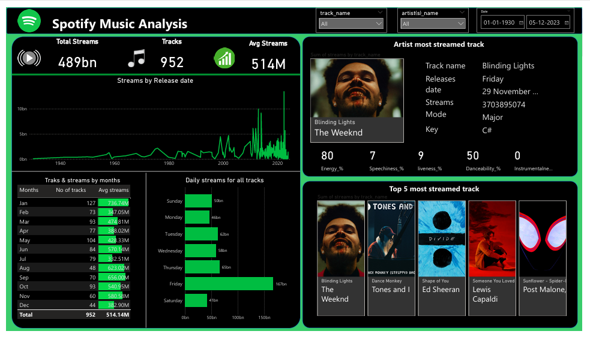
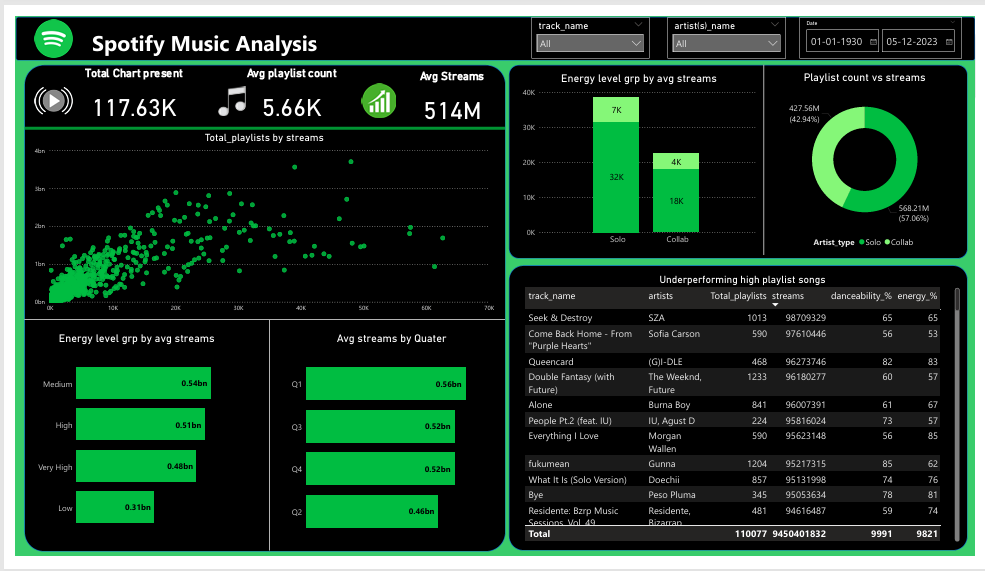

# Spotify_Music_Analysis

## Overview
This project presents an interactive Power BI dashboard analyzing Spotify music data across 952 tracks. The goal is to uncover patterns in **streaming behavior**, **audio features**, and **release strategies** to inform **growth and content decisions**—ideal for roles focused on data-driven music strategy.

---

## Problem Statement
With thousands of songs released daily, it's challenging to identify what makes certain tracks outperform others in terms of streams and listener engagement. Platforms like Spotify need to understand how factors like release timing, audio characteristics, and chart or playlist presence influence a song's success. Without these insights, optimizing release strategies and curating content for growth becomes guesswork.The insights are intended to support playlist optimization, release planning, and user engagement strategies for music platforms like Spotify.

---

## Tools & Technologies
- **Power BI**: Data cleaning, dashboard development and data modeling  
- **DAX**: Custom measures and calculated columns  

---

## Data Preparation Steps
1. **Cleaned Dataset**:
   - Removed nulls, formatted columns 
   - Converted audio feature metrics into readable % values

2. **Created Calendar Table**:
   - Built a custom Date table for time intelligence (Year, Month, Weekday)
   - Linked 'date` to the calendar for smooth filtering

2. **calculated columns**:
   - Built a calculated columns `Total_Playlists`, `Total_Chart_Presence`, `Artist_Type`, `Energy_Level_Group`
  
---

### 📍 **Dashboard 1 – Trends Overview**
- **KPIs**: Total Streams, Avg Streams, Total Tracks  
- **Trends by Month & Day**: Identified Friday and Aug–Sep as high-performing periods  
- **Top Songs**: Blinding Lights leads with 3.7B streams  
- **Insights**: High energy, medium danceability songs perform well

---

### 📍 **Dashboard 2 – Performance Deep Dive**
- **Scatter Plot**: Shows strong correlation between playlist count and streams  
- **Energy Level Analysis**: Medium energy tracks perform best (avg. 0.54B)  
- **Artist Type Analysis**: Solo artists drive more total streams  
- **Quarterly Analysis**: Q1 sees highest average stream volume; Q2 underperforms  
- **Underperforming Tracks**: Table flags songs with strong playlisting but weak results
- 
---
## Key Insights
- Friday and Q1 releases perform best — critical for scheduling drops  
- Mid-energy tracks get higher avg. streams; low-energy underperform  
- Playlist count helps, but alone doesn’t guarantee high engagement  
- Some tracks in 500+ playlists still lack impact — require deeper review  
- Solo artists dominate volume, but strategic collabs still show promise

---

## Recommendations
- Prioritize Q1 and Friday releases for major drops  
- Promote tracks with **medium-to-high energy** for better engagement  
- Monitor underperforming playlist-heavy songs for optimization  
- Balance quantity and quality in collab releases  
- Tailor playlist placement based on energy/danceability fit

---

## Dashboard Preview

 

---

 
